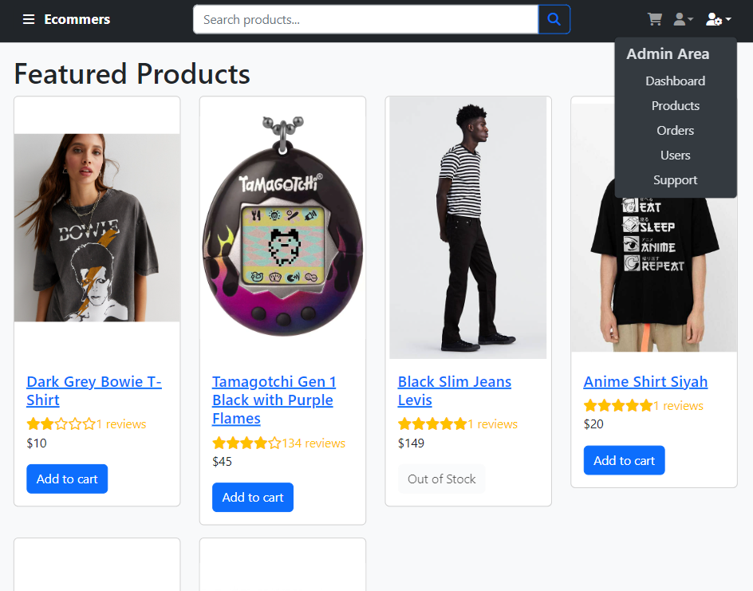

# Hi!

I am Sebastian Valencia Lasprilla and this is an application that I developed personally to learn, explore and see the possibilities of MERN Full Stack development.

## 📑 Indice

- 1. [What is Ecom-svl?](#What)
- 2. [Views and Features](#Views)
- 3. [For contact](#For)

## What is Ecom-svl?

Ecom-svl is a full-stack Mern e-commerce web app:

**Website:** [ecom-svl.onrender.com](https://ecom-svl.onrender.com/)
(App loading time may take a few seconds due to limitations of the free host)

**You can create your own account or use one of the accounts below:**
| user | pass |
| ------------------------- | :----------: |
| example-user@example.com | exampleuser |
| For test admin features: | |
| example-admin@example.com | exampleadmin |

**For test Payments:**

Paypal sandbox acount:
| user | pass |
| ------------------------- | :----------: |
| sb-wmc1m22597783@personal.example.com | 12345678 |

This application was developed with:

- React js
- Node and ExpressJs
- MongoDB
- React Bootstrap
- Using cloud services like Sendgrid, Google Map, PayPal, MongoDB Atlas, Render and more.
- Context API to manage state of React Application like cart items, user authentication with Jwt Token, and more.

The initial idea is to create a sales platform, a store with an **E-commennrce** feature that allows shopping, cataloging, rating, reviewing, shipping system, etc.

Enabled with **administration tools** such as a dashboard and management of products, users, orders and support.

This application is **responsive**, enabled as a **PWA** application and has the idea to be a native application with conversion methods with the help of pwa integration in the future.

## Views and Features:

### 🔸Responsive and Pwa:

### 🔸User registrations, login and password recovery:

### 🔸Product and Gallery overlay:

### 🔸Rating and Review:

### 🔸Product search:

### 🔸Profile modification:

### 🔸Order History:

### 🔸Cart:

### 🔸Shipping and Google maps integration:

### 🔸Payment:

### 🔸Chat Support:

### 🔸Mailing:

### --Admin Features---

### 🔸🔸Dashboard:

### 🔸🔸Products management:

### 🔸🔸Orders management:

### 🔸🔸Users management:

### 🔸🔸Users management:

## For contact:

Feel free to contact me for any help or interest via github or send me an email at **se.valas@outlook.com**.
# 😃 Thank you very much for taking a look at my project.
